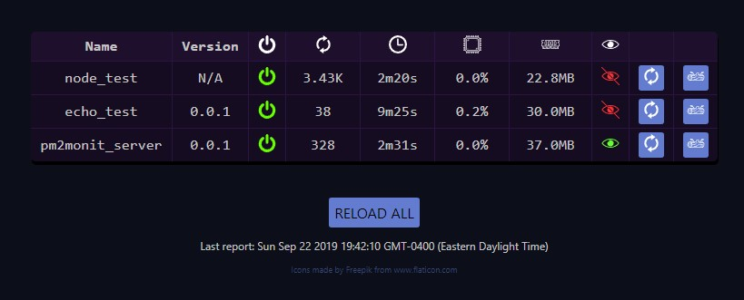
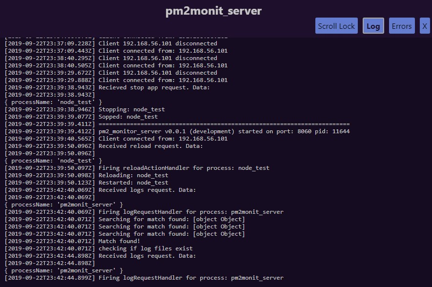
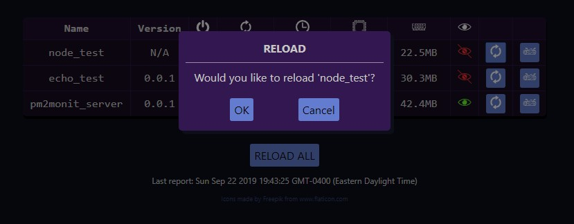

# PM2 Monitor
Simple web interface for monitoring [PM2](http://pm2.keymetrics.io/), a node.js process manager.
Backend is basic node.js and should likely be managed by PM2.
Frontend is ReactJS.

## Features
- Shows basic stats for all running apps (name, version, status, restarts, uptime, memory load, cpu load)
- Displays logs and error logs
- Start / stop any process
- Reload any process or all at once
- Basic login example included

## Installation
Clone this repo then run `install` from bash

## Notes
Only tested on CentOS 7

## Contributing
Please do! Currently looking to improve the log reporting process so that the entire log isn't sent every cycle. Would also be nice to implement some generics for metrics for the app's DetailView.